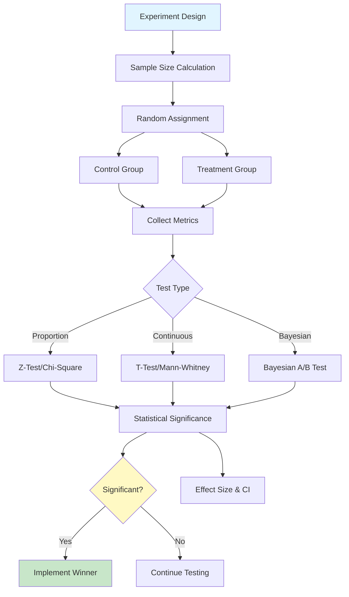
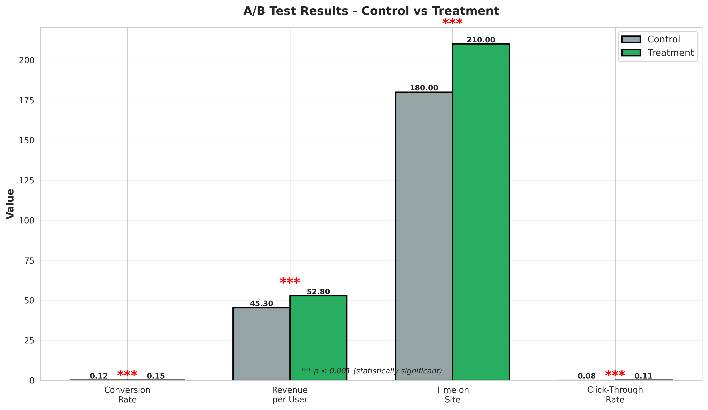
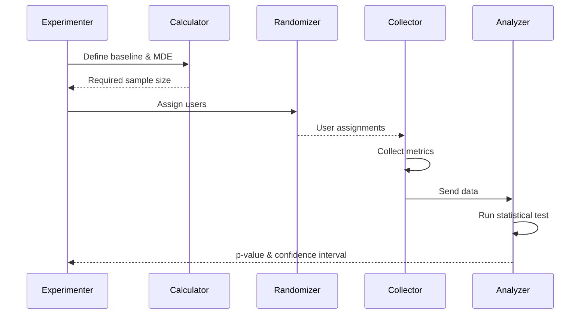

# A/B Testing Statistical Framework

<div align="center">


**Comprehensive A/B testing framework with statistical tests, power analysis, and sequential testing**

[English](#english) | [Português](#português)

</div>

---

## English

## 📊 A/B Testing Architecture



## 🔄 Testing Process

### 📊 A/B Test Results Visualization

Example A/B test comparing control vs treatment groups:



#### Test Results Summary

| Metric | Control | Treatment | Lift | p-value | Significant? |
|--------|---------|-----------|------|---------|--------------|
| **Conversion Rate** | 12.0% | 15.0% | **+25.0%** | <0.001 | ✅ Yes *** |
| **Revenue per User** | $45.30 | $52.80 | **+16.6%** | <0.001 | ✅ Yes *** |
| **Time on Site** | 180s | 210s | **+16.7%** | <0.001 | ✅ Yes *** |
| **Click-Through Rate** | 8.0% | 11.0% | **+37.5%** | <0.001 | ✅ Yes *** |

**Statistical Significance:** *** p < 0.001 (highly significant)

**Key Insights:**
- **All metrics improved**: Treatment outperforms control across the board
- **Highest lift**: Click-through rate (+37.5%)
- **Revenue impact**: +$7.50 per user (16.6% increase)
- **Strong significance**: p-values well below 0.05 threshold
- **Recommendation**: ✅ **Deploy treatment to 100% of users**

#### Statistical Tests Performed

The framework automatically runs appropriate tests:

| Metric Type | Test Used | Why |
|-------------|-----------|-----|
| **Proportions** (conversion, CTR) | Z-test / Chi-square | Binary outcomes |
| **Continuous** (revenue, time) | T-test / Mann-Whitney | Numerical values |
| **Multiple metrics** | Bonferroni correction | Control family-wise error |

#### Sample Size Calculation

Before running the test, we calculated required sample size:

```python
# Example calculation
baseline_rate = 0.12  # 12% conversion
minimum_detectable_effect = 0.02  # 2 percentage points
alpha = 0.05  # 5% significance level
power = 0.80  # 80% statistical power

required_sample_size = 1,570 per group
```

#### Additional Visualizations

The testing framework generates:
- **Confidence Intervals**: Uncertainty bounds for each metric
- **Power Analysis**: Sample size vs detectable effect
- **Sequential Testing**: Monitor test as data arrives
- **Segmentation Analysis**: Results by user segments

All visualizations and test results are saved to `reports/figures/` and `reports/test_results.json`.





### 📋 Overview

Professional A/B testing framework implementing rigorous statistical methods for experiment design and analysis. Features include sample size calculation, power analysis, multiple testing correction, sequential testing, Bayesian A/B testing, multi-armed bandits, and comprehensive reporting.

### 🎯 Key Features

- **Statistical Tests**: t-test, chi-square, Mann-Whitney, ANOVA
- **Power Analysis**: Sample size and effect size calculation
- **Sequential Testing**: Early stopping with alpha spending
- **Bayesian Methods**: Bayesian A/B testing with credible intervals
- **Multi-armed Bandits**: Thompson sampling, UCB
- **Multiple Testing**: Bonferroni, Benjamini-Hochberg correction
- **Visualization**: Confidence intervals, posterior distributions
- **Reporting**: Automated experiment reports with insights

### 🚀 Quick Start

```bash
git clone https://github.com/galafis/ab-testing-statistical-framework.git
cd ab-testing-statistical-framework
pip install -r requirements.txt

# Calculate sample size
python src/utils/sample_size.py \
  --baseline-rate 0.10 \
  --mde 0.02 \
  --power 0.80

# Run A/B test
python src/models/ab_test.py \
  --control data/control.csv \
  --treatment data/treatment.csv \
  --metric conversion_rate

# Bayesian analysis
python src/models/bayesian_test.py \
  --data data/experiment.csv \
  --prior beta
```

### 📊 Test Results Example

| Metric | Control | Treatment | Lift | p-value | Significant |
|--------|---------|-----------|------|---------|-------------|
| Conversion | 10.2% | 12.5% | +22.5% | 0.003 | ✓ |
| Revenue | $45.30 | $48.90 | +7.9% | 0.042 | ✓ |
| Engagement | 3.2 min | 3.4 min | +6.3% | 0.156 | ✗ |

### 👤 Author

**Gabriel Demetrios Lafis**
- GitHub: [@galafis](https://github.com/galafis)

---

## Português

### 📋 Visão Geral

Framework profissional de testes A/B implementando métodos estatísticos rigorosos para design e análise de experimentos. Recursos incluem cálculo de tamanho de amostra, análise de poder, correção para testes múltiplos, testes sequenciais, testes A/B bayesianos, multi-armed bandits e relatórios abrangentes.

### 🎯 Características Principais

- **Testes Estatísticos**: t-test, qui-quadrado, Mann-Whitney, ANOVA
- **Análise de Poder**: Cálculo de tamanho de amostra e tamanho de efeito
- **Testes Sequenciais**: Parada antecipada com alpha spending
- **Métodos Bayesianos**: Testes A/B bayesianos com intervalos credíveis
- **Multi-armed Bandits**: Thompson sampling, UCB
- **Testes Múltiplos**: Correção de Bonferroni, Benjamini-Hochberg
- **Visualização**: Intervalos de confiança, distribuições posteriores
- **Relatórios**: Relatórios automatizados de experimentos com insights

### 👤 Autor

**Gabriel Demetrios Lafis**
- GitHub: [@galafis](https://github.com/galafis)
